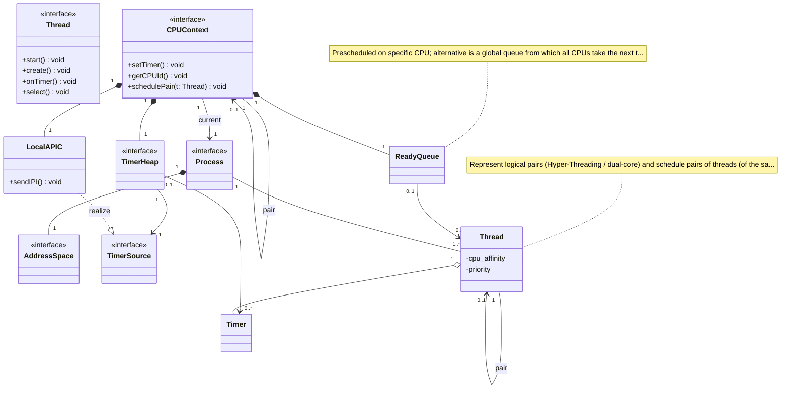
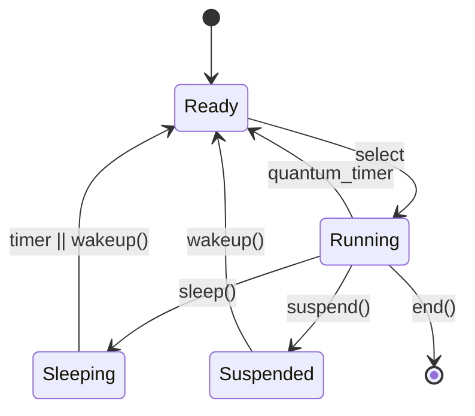
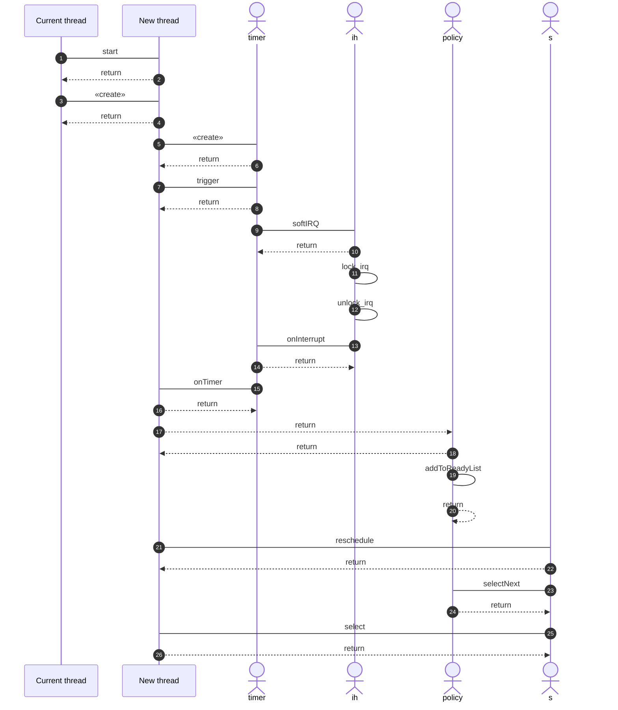

# MyOS Model (from MyOS-model.xmi)

Converted from the NetBeans/Poseidon UML XMI export (2008).

## Class diagram — model 1.1

## State diagram — Thread states

## Sequence diagram — Thread creation & startup

