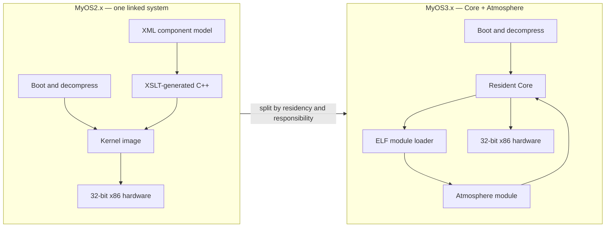
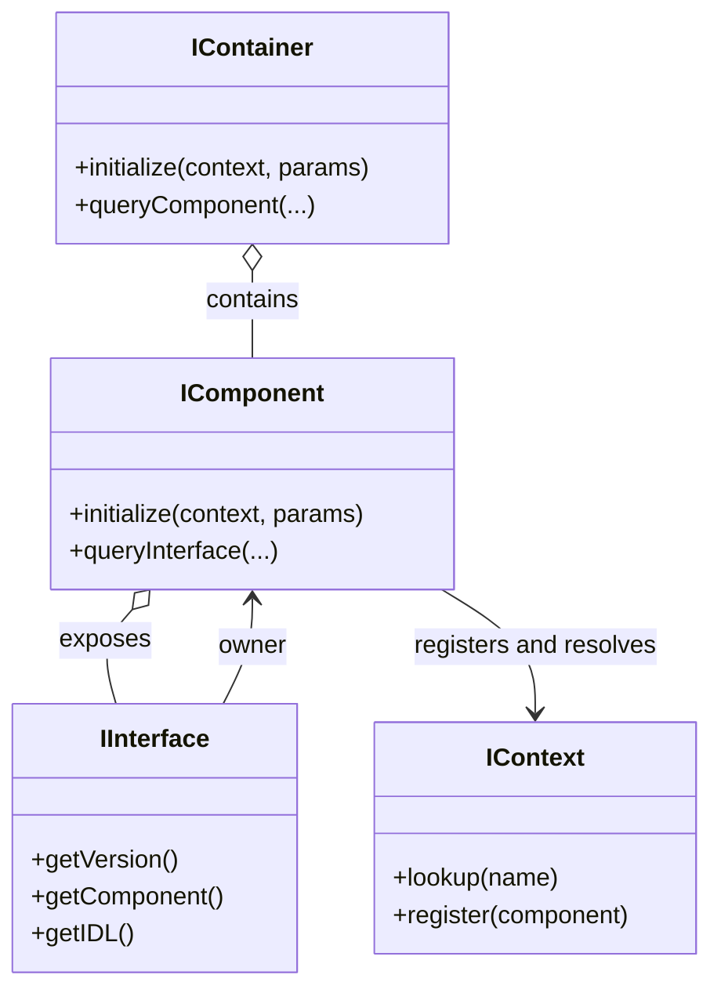
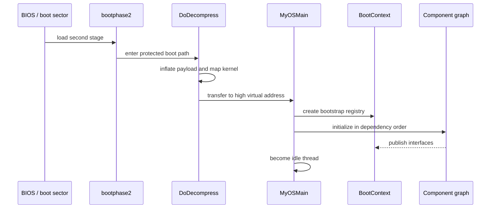
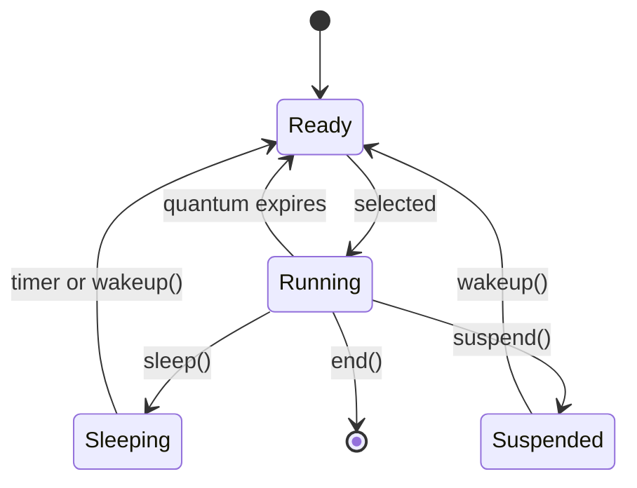
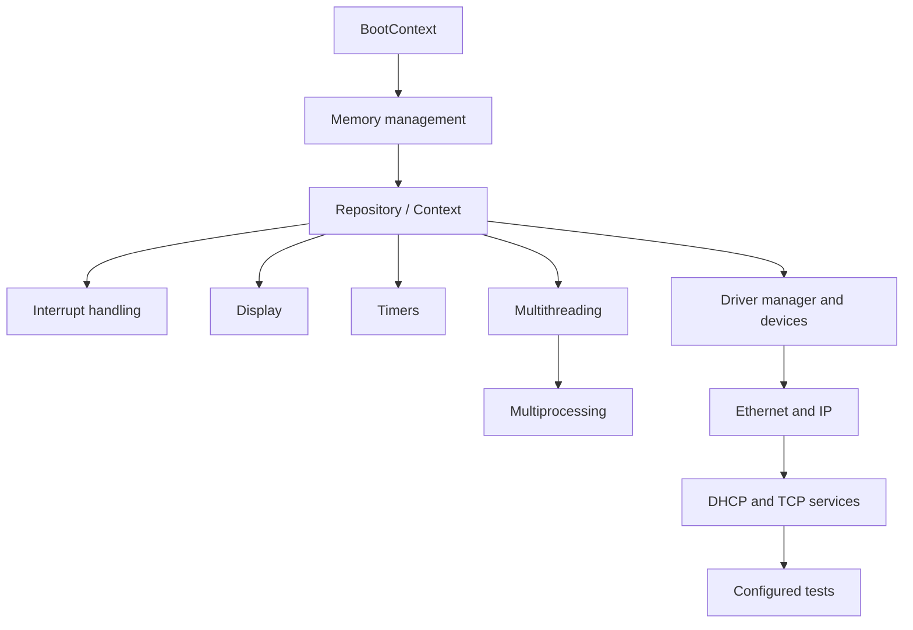
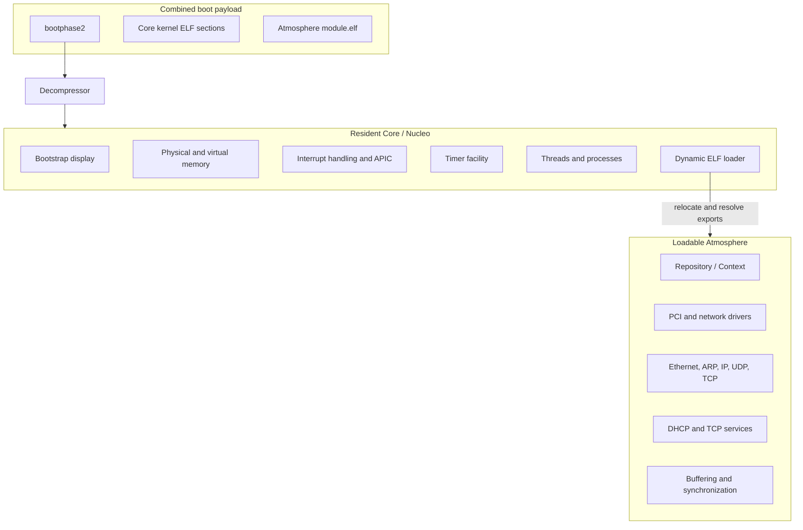

# MyOS

MyOS is an experimental, freestanding 32-bit x86 operating system written
primarily in C++. This repository preserves two evolutions of the design:

- **MyOS2.x** is a single, statically linked kernel assembled from an
  XML-described component graph.
- **MyOS3.x** separates a small resident **Core** from an ELF-loadable
  **Atmosphere** containing higher-level drivers, networking, repository, and
  services.

Both versions explore the same central idea: organize kernel facilities as
versioned C++ components and interfaces, then bootstrap them into a shared
context. They include their own boot path, memory management, interrupt and
timer handling, multiprocessing and threading, device drivers, networking,
services, compression, and a small C++ runtime.

## Development period

MyOS was developed over roughly a decade, from **2002 through 2012**. Early
MyOS2.x source headers date to 2002; the preserved MyOS3.x source archives and
design models document the transition during 2007–2008; and the latest recorded
MyOS3.x build metadata is dated January 2012. The repository therefore captures
both the initial component-oriented kernel and its later Core/Atmosphere
evolution.

## The evolution at a glance



| | MyOS2.x | MyOS3.x |
|---|---|---|
| Deployment | One statically linked kernel | Resident kernel plus relocatable ELF module |
| Composition | XML/XSLT-generated container | Handwritten Core and Atmosphere containers |
| Resident facilities | Full system stack | Boot, MM, interrupts, display, timers, MT/MP, loader |
| Higher-level facilities | Linked into the kernel | Repository, drivers, networking, and services in Atmosphere |
| Build output | `kernel.elf`, `kernel.bin`, FAT12 floppy image | `kernel.elf`, `module.elf`, combined `kernel.bin` |
| Current host build | Linux shell scripts and GNU tools | Parallel GNU Make and GNU tools |

## Shared architectural vocabulary

The two versions are not unrelated rewrites. They share a component model,
boot protocol, major subsystems, and scheduling concepts.

### Components, interfaces, containers, and context

An `IComponent` owns implementations, an `IInterface` exposes a versioned
contract, an `IContainer` groups components, and an `IContext` acts as the
runtime registry through which components find one another. XML descriptions
provide UUIDs and composition metadata; XSLT turns those descriptions into C++
interfaces and containers.

The MyOS2.x root interface calls itself out plainly in
[`IInterface.h`](MyOS2.x/src/Core/IInterface.h):

```cpp
/**
 * The mother of all interfaces
 */
class IInterface
```

That interface carries its implementation version and a reference to its
owning component. This is the common seam used for discovery, safe casting,
lifecycle control, and stream-oriented calls.



### Boot and initialization

The boot sector loads a second-stage bootstrap and compressed payload. The
decompressor establishes the high kernel mapping, prepares page tables, clears
the BSS, and transfers control to `MyOSMain`. Initialization deliberately uses
a temporary boot context before the normal repository is ready. The source in
[`MyOSMain.cpp`](MyOS2.x/src/Init/MyOSMain.cpp) describes that two-stage
bootstrap:

```cpp
// Phase 1: Before MM and Repository are initialized, components register
//          with the bootcontext
// Phase 2: Proper context is created (using dynamic malloc)
//          Existing registrations are copied to the new context
```



### Scheduling model

The UML model preserved with MyOS3.x emphasizes per-CPU scheduling, timer
heaps, processor affinity, and paired logical processors. At its simplest, a
thread moves through this lifecycle:



The fuller recovered model is available in
[`MyOS-model.mmd.md`](MyOS3.x/MyOS-model.mmd.md), including CPU contexts,
ready queues, local APIC timers, processes, and thread-start sequencing.

## MyOS2.x: generated, integrated kernel

MyOS2.x composes nearly the whole system into `MyOSCoreContainer`. Its XML
model selects components, interfaces, drivers, and services; Saxon/XSLT emits
the corresponding C++ glue. The generated container then initializes each
facility in dependency order.



The generated initializer in
[`MyOSCoreContainer.cpp`](MyOS2.x/build/gen_src/Init/MyOSCoreContainer.cpp)
shows the model becoming executable policy:

```cpp
if ((r=mM.initialize(context,params))!=E_MYOS_SUCCESS) return r;
if ((r=repository.initialize(context,params))!=E_MYOS_SUCCESS) return r;
if ((r=iH.initialize(repository.getContext(),params))!=E_MYOS_SUCCESS) return r;
```

The result is broad for a small experimental kernel: IDE, floppy, USB, PCI,
display and network drivers; FAT and ISO9660; Ethernet, ARP, IP, UDP and TCP;
DHCP and test services; virtual memory, SMP, synchronization, timers, XML, and
ZIP decompression all live in the same linked image.

Build and run instructions are in [`MyOS2.x/README.md`](MyOS2.x/README.md).

## MyOS3.x: Nucleo Core and Atmosphere

MyOS3.x redraws the boundary. The **Core** (called `Nucleo` in its container
source) retains the facilities needed to boot, allocate and map memory, handle
interrupts, schedule execution, keep time, and load another binary. The
**Atmosphere** is compiled as a relocatable ELF module and initialized through
the Core's context.



The hand-written Core container makes the new boundary explicit in
[`MyOSCoreContainer.cpp`](MyOS3.x/code/Core/src/Nucleo/MyOSCoreContainer.cpp):

```cpp
// Now initialize Atmosphere as a separate module
ld.loadInitialModule( context );
```

Atmosphere exposes an `initModule` entry point and initializes its own graph.
From [`ASContainer.cpp`](MyOS3.x/code/Atmosphere/src/AS/ASContainer.cpp):

```cpp
// Atmosphere now built as module
#include "module.h"

int initModule( MyOS::Context::IContext &context )
```

The Core's loader reads ELF section and symbol tables, relocates the module,
and resolves module imports against a generated kernel export table. This is a
structural evolution rather than a change in the component philosophy: both
halves still communicate through the same interfaces and context.

Build instructions and generated artifacts are documented in
[`MyOS3.x/README.linux.md`](MyOS3.x/README.linux.md). The normal parallel build
is:

```sh
cd MyOS3.x
make -j"$(nproc)"
```

## Source size

The following counts are **physical lines**, so they include comments and blank
lines. They count C, C++, headers, inline implementation files, and assembly in
the primary source trees. Generated code, build output, `Attic`, `old_src`, and
Subversion metadata are excluded. XML/XSLT inputs are reported separately.

| Version / partition | Files | Physical lines |
|---|---:|---:|
| MyOS2.x production (`src`, excluding `src/Tests`) | 403 | 43,967 |
| MyOS2.x tests | 13 | 969 |
| **MyOS2.x total source** | **416** | **44,936** |
| MyOS3.x Core | 193 | 28,865 |
| MyOS3.x Atmosphere | 151 | 17,871 |
| MyOS3.x tests | 12 | 823 |
| **MyOS3.x total source** | **356** | **47,559** |

| Version | C/C++ implementation | Headers / inline files | Assembly | XML/XSLT model |
|---|---:|---:|---:|---:|
| MyOS2.x | 20,510 lines | 23,885 lines | 541 lines | 2,216 lines |
| MyOS3.x | 20,184 lines | 25,774 lines | 1,601 lines | 2,353 lines |

The totals show the architectural shift more clearly than a simple growth
number: MyOS3.x keeps about 61% of its source in Core and moves about 38% into
Atmosphere, with tests accounting for the remainder. MyOS2.x has no equivalent
binary boundary; its subsystem graph is linked together.

## Repository map

```text
MyOS2.x/
  src/                 integrated kernel implementation
  xml/, xslt/          component descriptions and code generation
  build-linux.sh       Linux-hosted kernel build
  build-floppy.sh      FAT12 floppy image creation

MyOS3.x/
  code/Core/           resident Nucleo kernel
  code/Atmosphere/     loadable higher-level subsystem module
  code/Tests/          standalone and module tests
  xml/, xslt/          retained component metadata and generators
  Makefile             parallel Linux-native build
  MyOS-model.mmd.md    recovered Mermaid design models
```

MyOS is historical systems-research code: it assumes 32-bit x86, privileged
hardware access, a custom ABI/runtime, and BIOS-era boot media. It is best read
as an exploration of component-oriented kernel design and the transition from
one integrated image to a deliberately layered kernel/module architecture.
